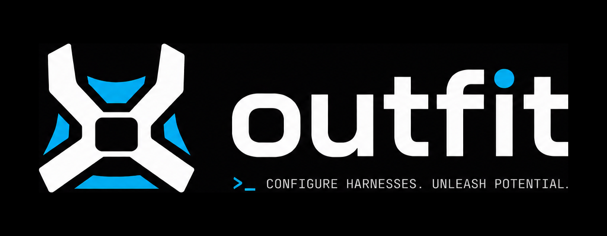

<p align="center">
  
</p>

Point [opencode](https://opencode.ai) at the model providers you actually use —
OpenRouter, AWS Bedrock, Ollama, llama.cpp, or any OpenAI-compatible endpoint —
with a single command. No hand-editing JSON, no clobbering the config you
already have.

## What it does

- Merges provider settings into your **global** opencode config
  (`~/.config/opencode`), keeping everything else — other providers, your theme,
  even your comments — exactly where you left it.
- Reads provider definitions from a catalogue (`providers.yaml`) baked into the
  binary, so there are no URLs or model ids to memorise.
- Pulls API keys from a local `.env` (or your environment) and writes the config
  `0600`, because secrets.

## Install

With [Homebrew](https://brew.sh):

```sh
brew install lucinate-ai/tap/outfit
```

To upgrade later, run `brew upgrade outfit`.

### From source

```sh
go build -o outfit .
```

Drop the resulting `outfit` binary anywhere on your `PATH`.

## Quickstart

See what's on the menu:

```sh
outfit list
```

Add a provider and a model family:

```sh
# OpenRouter needs a key — put it in .env first:
echo 'DEEPSEEK_API_KEY=sk-or-v1-...' > .env

outfit add --provider openrouter --model-family deepseek-v4
```

Then just run `opencode`.

## Usage

```sh
outfit list
outfit add    --provider <name> [--model-family <family>] [--model <id>] [--alias <name>] [--context <size>] [--output <size>] [--base-url <url>]
outfit remove --provider <name> [--model-family <family>] [--model <id>]
outfit apply  [path] [--output <size>]   # apply an Outfit file (default ./Outfit)
outfit unapply [path]                    # remove what an Outfit file selects
outfit serve  [path] [--dry-run]         # run llama-server from the Outfit's PRESET
outfit export [--provider <name>]        # print the current config as an Outfit
outfit init-providers [path]             # write the built-in catalogue out to edit
```

Short flags: `-p` (provider), `-f` (model-family), `-m` (model), `-a` (alias), `-c` (context), `-o` (output), `-u` (base-url).

### Examples

```sh
# A local Ollama model (no key required)
outfit add -p ollama -f llama

# Claude on AWS Bedrock (uses your AWS credentials)
outfit add -p amazon-bedrock -f claude

# Any OpenAI-compatible endpoint, base URL via flag
OPENAI_API_KEY=sk-... \
  outfit add -p openai-compatible -m my-model --base-url https://my-endpoint/v1

# Pin a specific default model
outfit add -p openrouter -f deepseek-v4 -m deepseek/deepseek-v4-pro

# Set the context window — human suffixes or an absolute count, both fine
outfit add -p llamacpp -m my-model -c 128k
outfit add -p llamacpp -m my-model --context 200000

# Cap the max output tokens too (defaults to a quarter of the context)
outfit add -p llamacpp -m my-model -c 128k -o 32k

# Take a provider back out
outfit remove -p ollama

# Or just drop one family's models
outfit remove -p openrouter -f deepseek-v4
```

`add` sets the chosen model as opencode's default. `remove` clears the default
if it pointed at something you removed.

`--context`/`-c` records each added model's context window. Parsing is
forgiving: `128k`, `1m`, `1.5m`, `200000`, `128,000`, even `128 K tokens` all
land where you'd expect (`k`/`m`/`g` are decimal — `128k` is 128,000 tokens).

`--output`/`-o` caps the max output tokens, in the same format. opencode needs
one whenever a context is set, so when you leave it off `outfit` fills in a
quarter of the context for you. It can't exceed the context window.

## Outfit files

Prefer to keep a provider selection in a file — like a `Dockerfile`, but for
opencode? Drop an **Outfit** in your project:

```dockerfile
# Outfit
PROVIDER openrouter
FAMILY   deepseek-v4
MODEL    deepseek/deepseek-v4-pro   # optional; the provider-native model ref
ALIAS    deepseek                   # optional; friendly name for the model
CONTEXT  128k                       # optional; context window
OUTPUT   32k                        # optional; max output tokens
BASEURL  https://gateway/v1         # optional; API base URL override
```

```sh
outfit apply              # reads ./Outfit and applies it
outfit apply path/to/Outfit
outfit export > Outfit    # capture your current setup as an Outfit
```

An Outfit describes one provider selection and applies exactly like the
equivalent `add`. Full syntax is in [`docs/outfit-file.md`](docs/outfit-file.md),
and ready-to-use examples live under [`examples/`](examples/).

## Serving a local model

Running a model with llama.cpp? `outfit serve` reads an Outfit and launches
`llama-server` for it — so the same file that points opencode at a model can
start it too. The simple case needs no preset:

```dockerfile
# Outfit
PROVIDER llamacpp
MODEL    unsloth/Qwen3.6-35B-A3B-GGUF:UD-Q4_K_XL   # HF repo, or a .gguf path
ALIAS    qwen3.6                                    # llama-server --alias
CONTEXT  32768                                      # llama-server --ctx-size
```

```sh
outfit serve              # builds a llama-server command and runs it
outfit serve --dry-run    # just print the command — no server
```

For flags an Outfit doesn't model (`-ngl`, `--jinja`, KV-cache types, draft
models), point at a llama.cpp preset `.ini` with `PRESET` and `serve` flattens
the chosen section into the command instead — with anything the Outfit states
(like `CONTEXT`) overriding the preset. It's the missing piece presets don't
cover: launching a *single* model. Details in
[`docs/outfit-file.md`](docs/outfit-file.md#serving-a-llamacpp-model).

## Keys and endpoints

Each provider declares which environment variable holds its key (`outfit
list` shows them). Values are looked up in `.env` next to the tool first, then
your shell environment. Local providers like Ollama and llama.cpp need no key;
Bedrock authenticates through your AWS credentials.

Base URLs default to the usual local ports. Override the endpoint for **any**
provider with `--base-url`/`-u` or the `OUTFIT_BASE_URL` env var — handy for
proxies, gateways, or a server on a non-default host:

```sh
outfit add -p openai-compatible -m my-model --base-url https://gateway/v1
OUTFIT_BASE_URL=https://gateway/v1 outfit add -p openai-compatible -m my-model
```

The flag wins over the env var, and either wins over the catalogue's defaults
and the per-provider variables (`OLLAMA_BASE_URL`, `LLAMACPP_BASE_URL`,
`OPENAI_BASE_URL`).

## Guides

Provider- and model-specific walkthroughs live in [`examples/`](examples/), each
with a ready-to-apply `Outfit`:

- [Qwen3.6-35B-A3B on llama.cpp](examples/llamacpp/qwen3.6/README.md)
- [Gemma-4-12B-IT on llama.cpp](examples/llamacpp/gemma4/README.md)

## Adding providers and models

Everything `outfit` knows lives in `internal/catalog/providers.yaml`. Add a
provider, a model family, or a new model there and rebuild — no Go required. The
file is commented with the schema.

Don't want to rebuild? Point `outfit` at your own catalogue at runtime — the
flag wins, then the env var, then the built-in default:

```sh
outfit list --providers ./my-providers.yaml
OUTFIT_PROVIDERS=./my-providers.yaml outfit list
```

Need a starting point? `init-providers` drops the built-in catalogue into the
current directory (it won't overwrite an existing file — pass a path or
`--force` if you mean to):

```sh
outfit init-providers                 # writes ./providers.yaml
outfit list --providers providers.yaml
```

The `.env` file and the built binary are git-ignored.
